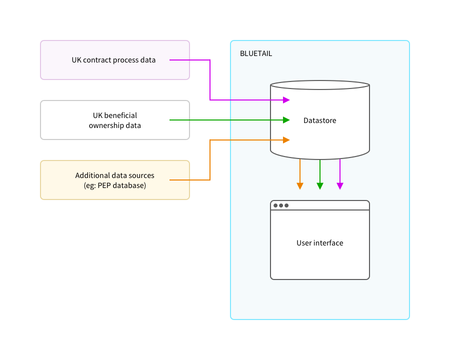
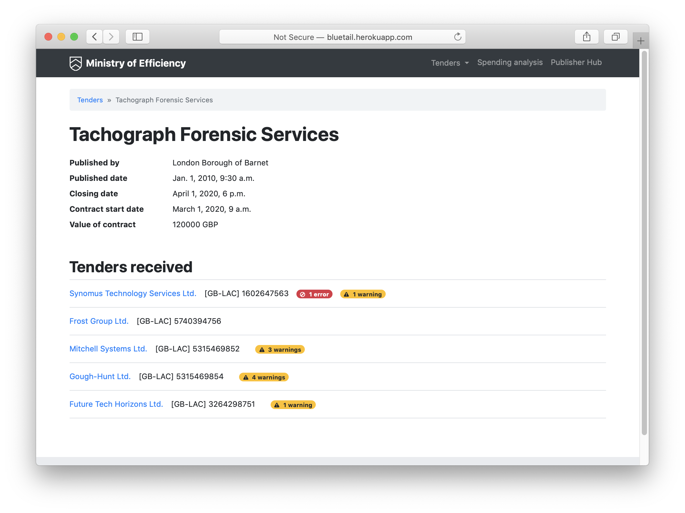
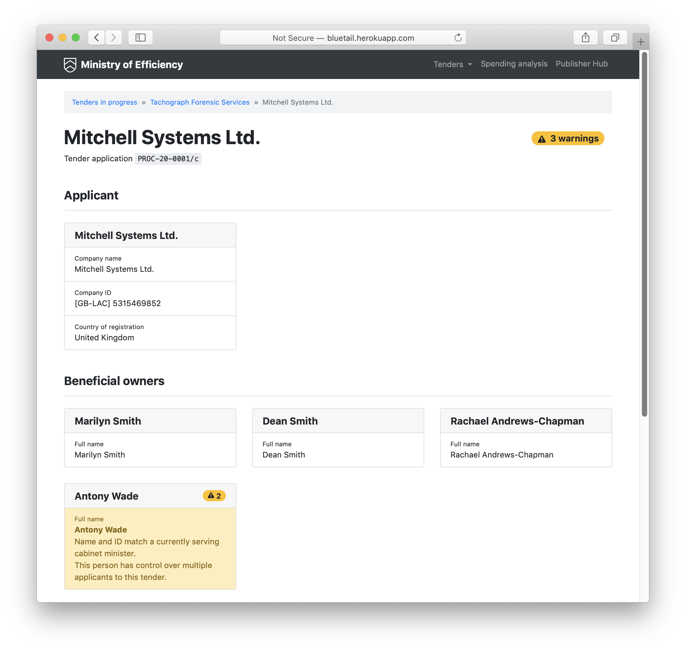

- [Bluetail](#bluetail)
  * [Interfaces](#interfaces)
  * [Installation](#installation)
    + [Running Bluetail locally (with Vagrant)](#running-bluetail-locally-with-vagrant)
    + [Running Bluetail locally (without Vagrant)](#running-bluetail-locally-without-vagrant)
    + [Deployment to Heroku](#deployment-to-heroku)
  * [Testing](#testing)
  * [Running](#running)
    + [Assets](#assets)
    + [Data loading](#data-loading)
    + [Flags](#flags)

# Bluetail

Bluetail is an example project combining beneficial ownership and contracting data, for use during government procurement. It is named after the [Himalayan Bluetail](https://en.wikipedia.org/wiki/Himalayan_bluetail) which was first described in 1845.

It ingests data about contracting processes in [OCDS](https://standard.open-contracting.org/latest/en/) format, data about beneficial ownership in [BODS](http://standard.openownership.org/en/0.2.0/index.html) format and data about other aspects of people in [Popolo](http://www.popoloproject.com/) format and combines them to flag situations for further investigation.



## Interfaces






## Installation

### Running Bluetail locally (with Vagrant)

Clone the repository

```
git clone git@github.com:mysociety/bluetail.git
cd bluetail
```

A Vagrantfile is included for local development. Assuming you have [Vagrant](https://www.vagrantup.com/) installed, you can create a Vagrant VM with:

```
vagrant up
```

Then SSH into the VM, and run the server script:

```
vagrant ssh
script/server
```

The site will be visible at <http://localhost:8000>.


### Running Bluetail locally (without Vagrant)

You’ll need:

* Python 3.6
* A local Postgres server

As above, make sure you’ve cloned the repo.

Open up a Postgres shell (eg: `psql`) and create a user and database matching the details in `conf/config.py`:

```
CREATE USER bluetail SUPERUSER CREATEDB PASSWORD 'bluetail'
CREATE DATABASE bluetail
```

Create a Python virtual environment at a location of your choosing, activate it, and install the required packages:

```
python3 -m venv ./venv
. ./venv/bin/activate
pip3 install --requirement requirements.txt
```

With the virtual environment still activated, run the Django migrations, to set up the database:

```
script/migrate
```

If you want to load example data, run:

```
script/setup
```


And run the development server:

```
script/server
```

### Deployment to Heroku

Heroku has good documentation for deploying using git. https://devcenter.heroku.com/articles/git

These environment variables must be set on the Heroku app before deployment.

    DJANGO_SETTINGS_MODULE=proj.settings_heroku
    DATABASE_URL="postgres://..."
    SECRET_KEY=

If you have forked the GitHub Repository you can connect your GitHub fork to a Heroku app and deploy using the Heroku dashboard:

https://devcenter.heroku.com/articles/github-integration

Or else you can push your git clone directly to your Heroku app. This is easiest done using the Heroku CLI tools. https://devcenter.heroku.com/articles/heroku-cli

1. Log in to Heroku CLI (https://devcenter.heroku.com/articles/heroku-cli#getting-started)
2. Add the Heroku app git remote to your git clone

    Execute this command in your bluetail clone root directory

        heroku git:remote --app your_heroku_appname

3. Push your branch to the Heroku remote `master` branch.

        git push heroku master

    Note you can push any local branch, but it must be pushed to the Heroku remote `master` branch to deploy.

        git push heroku [local_branch_to_push]:master

    If there are issues/errors from the Heroku git repo it can be reset first using https://github.com/heroku/heroku-repo

        heroku plugins:install heroku-repo
        heroku repo:reset -a bluetail

4. (Optional) Run the setup script to reset the Heroku database with the demo data.

        heroku run "script/setup"

    4. Or else simply run migrate for a clean database.

            heroku run "python manage.py migrate"


## Testing

There are just a few tests written to aid development.
To run use this command

    script/manage test

## Running

### Assets

Django‘s [staticfiles](https://docs.djangoproject.com/en/2.2/ref/contrib/staticfiles/) app copies all the static files (including sass files) to `/static`, and then [django-pipeline](https://django-pipeline.readthedocs.io/en/latest/index.html) compiles the sass files to css, in place, in `/static`

The Django test server will compile and collect the static files automatically when it runs. But sometimes (eg: when you delete a file from `/web/sass/` and the change doesn’t seem to be picked up by the server) it might be necessary to force Django to re-process the static files. You force a full rebuild of the static files with:

```
script/manage collectstatic --noinput --clear
```

### Data loading

Bluetail uses the [Scripts to Rule Them All](https://github.blog/2015-06-30-scripts-to-rule-them-all/) design pattern. `script/setup` will recreate the database schema and load datasets into the database from the data/ directory.

Bluetail ingests [BODS](http://standard.openownership.org/en/0.2.0/index.html) and [OCDS](https://standard.open-contracting.org/latest/en/) data in JSON format, by default from the example datasets in the data/ directory. This data is then stored in postgres json fields. Postgres views are then used to expose the information to the application.

UK example data is included and used in Bluetail, but requires pre-processing. If you're not interested in UK data, skip to [data ingest](#data-ingest).

#### UK data pre-processing

##### Contract process data

The example UK raw contract data is not sufficient to support the prototype interfaces. It is pre-processed by the script `data/processing/scripts/get_fix_cf_notices.py`:
* As raw data from Contracts Finder does not have Companies House identifiers to uniquely identify the companies associated with the contracting processes represented, data is pulled from a source (the OpenOpps database) where a manual matching process has been used to add Companies House identifiers to the OCDS from Contracts Finder.


* As no internal identifiers are used in the Contracts Finder OCDS to cross-reference the party from other sections of the release (these identifiers are required by the standard), IDs are generated and added.

* The listed version of the OCDS released from Contracts Finder is incorrect - the preprocessing step uses ocdskit to upgrade the version of the JSON to the version listed.

* Contracts Finder does not release OCDS at the point of tender, only at the point of award, and does not release information about bidders for a given process, so the OCDS is transformed to convert the awarded suppliers into tenderers to demonstrate this earlier stage of the process.


The data pre-processing step creates three example datasets under `data/contracts_finder/ocds` with the suffixes **raw**, **supplier_ids_match** and **bodsmatch** under data/contracts_finder. These datasets represent:
* **raw** All suppliers are included, and Companies House IDs are added where a match is found
* **supplier_ids_match** Suppliers have a match with a Companies House ID in manual match data, other suppliers are removed
* **bodsmatch** All retained suppliers have a match in the BODS dataset (relying on the Companies House ID match), other suppliers are removed

Of these three example datasets, bodsmatch represents an ideal dataset. This has tendering companies listed in the contract data, with fully populated accompanying unique identifiers from a canonical source of organisational identifiers, and beneficial ownership information available for each company, in a dataset that uses the same identifiers.


### Updating the OCDS data (TODO Louise edit this update from Erin/Sim)

There is a standalone script to download/update the OCDS JSON data:

- `bluetail/data/contracts_finder/processing/scripts/cf_notices_ocds_api.py`

**NOTE This script uses the Elasticsearch BODS index created by `create_openownership_elasticsearch_index` and supplied Companies House matched IDs in `openopps_supplier_matches.csv` for matching.**

There is a Django management command wrapper that can be called using:

    script/manage get_contracts_finder_ocds_data
    
The script has options to overwrite the existing example files by OCID, or to search notices between dates from the Contracts Finder API.

Further arguments can be added to create datasets where all entities have a matching BODS document, Companies House ID, or leaving all distinct entities in.

Note existing data uses fully BODS matched suppliers.

As tenderer information is not given in the tender phase, this uses successful suppliers in award documents and uses them to replicate tenderers in the competitive phase.

Sample data is provided in the dirs

    /bluetail/data/contracts_finder/ocds/json_1_1_bods_match
    /bluetail/data/contracts_finder/ocds/json_1_1_supplier_ids_match
    /bluetail/data/contracts_finder/ocds/json_1_1_raw

To download the raw data again or with different arguments run these commands:

    script/manage get_contracts_finder_ocds_data --dataset=raw

Or for the linked data
NOTE: This depends on there being Companies House numbers linked to the OCDS suppliers in the `openopps_supplier_matches.csv` file! 

    script/manage get_contracts_finder_ocds_data --dataset=suppliermatch
    script/manage get_contracts_finder_ocds_data --dataset=bodsmatch
    
To update just existing files append `--update`

    script/manage get_contracts_finder_ocds_data --dataset=raw --update
    script/manage get_contracts_finder_ocds_data --dataset=suppliermatch --update
    
To clear the existing data first append `--clear`

    script/manage get_contracts_finder_ocds_data --dataset=raw --clear
    
After updating the local OCDS files, we need to insert it and rerun the BODS data script to download the BODS statements from the Elasticsearch index

    script/manage insert_data bluetail/data/contracts_finder --anonymise
    script/manage get_bods_statements_from_ocds
    
We then insert the data again with the BODS data

    script/manage insert_data bluetail/data/contracts_finder --anonymise

And run `scan_contracts` to update the flags.

    script/manage scan_contracts
    
Or run the full setup instead to rebuild the database using all the latest files

    script/setup 

##### Beneficial ownership data

This data is pre-processed using two management commands.
`create_openownership_elasticsearch_index` creates an Elasticsearch index from a bulk download of the OpenOwnership register data, which includes data from the Persons of Significant Control Register.

This requires the `ELASTICSEARCH_URL` environment variable to be set

    ELASTICSEARCH_URL="https://..."

To change the index name from the default `bods-open_ownership_register`, also set `ELASTICSEARCH_BODS_INDEX`

    ELASTICSEARCH_BODS_INDEX="bods-open_ownership_register"

Run the command using:

    script/manage create_openownership_elasticsearch_index

`get_bods_statements_from_ocds` uses the Elasticsearch index to identify BODS statements referring to the ownership of companies that match the Companies House identifiers of tenderers in the contracts process data and write them to `data/contracts_finder/bods/ch_id_openownership_bods`.

NB. Note this only does 1 level of lookup currently. ie.

* This will get all BODS statements for the Beneficial owners of a company
* This does NOT lookup these immediate beneficial owners or parent companies to get further companies/persons related to those

This command requires also requires the `ELASTICSEARCH_URL` environment variable to be set

    ELASTICSEARCH_URL="https://..."

Run the command using:

    script/manage get_bods_statements_from_ocds


#### Data ingest

##### Contracting process and beneficial ownership data

Bluetail comes with two example datasets: the original data from the static prototype interfaces, stored in `data/prototype`, and a dataset from the UK Contracts Finder service and Persons of Significant Control Register, stored in `data/contracts_finder`. As described above, the Contracts Finder data is in three versions:, raw, pruned to the suppliers with identifiers, and pruned to the suppliers with identifiers and beneficial ownership information.

The commands for loading this data are:

    script/manage insert_prototype_data

    script/manage insert_data bluetail/data/contracts_finder --anonymise

The anonymise flag is used because we have manipulated real data in order to create the example datasets, and we want to avoid live or example sites that suggest relationships that do not exist for real people and companies. Anonymisation replaces names, birthdates and addresses of individuals, and names of procuring organisations and companies with fake versions, preserving the associations between entities. Leaving out this command would allow an ingest and comparison of real ownership and contracts data.

Data can be loaded from another set of json files by calling `insert_data` with a different directory argument. The expectation is that that directory will contain subdirectories named `ocds` and `bods`, each containing json files with valid OCDS and BODS data in them.

Bluetail uses one preferred [identifier scheme](http://standard.openownership.org/en/0.2.0/schema/guidance/identifiers.html) when matching and displaying companies - this is set in the `COMPANY_ID_SCHEME` setting in `config.py`.

##### Additional data sources

In order to support the use cases around identifying conflicts of interest and identifying sanctioned individuals in ownership, Bluetail supports the import of information around people from other data sources, which could be lists of politically exposed persons, lists of procurement officers or sanctioned individuals.  Bluetail supports loading a set of people, identified by names and identifiers, from a Popolo file, and associating them with a flag to be applied if these people are matched to beneficial owners associated with companies involved in a public procurement process. So, for example, a set of politically exposed people would be associated with one flag, whereas a list of sanctioned individuals would be associated with a different flag.

The command for this is:

    script/manage load_identifiers_from_popolo

The `ExternalPerson` model stores external identifiers, along with the flag that the identifier applies to. These external identifiers can come from any external data source, as long as there's an appropriate flag to attach.

To give an example of how this works, in `script/setup`, a random set of identifiers and names are taken from the beneficial owner data,  loaded into the database, and associated with the flag that indicates a match with a cabinet minister.

This fake data loading is done with the commands:

    script/manage generate_fake_popolo > fake_popolo.json

    script/manage load_identifiers_from_popolo fake_popolo.json person_id_matches_cabinet_minister

The comparison and flagging process for applying all flags is then run by:

    script/manage scan_contracts

### Flags

Flags are warnings/errors about the data, attached to an individual or company and/or a contracting process. Flags can be viewed and edited in the admin interface

    http://127.0.0.1:8000/admin/

If you don't have a superuser, create one manually like this

    python manage.py createsuperuser

or without prompt (username: admin, password: admin)

    echo "from django.contrib.auth import get_user_model; User = get_user_model(); User.objects.create_superuser('admin', 'admin@myproject.com', 'admin')" | python manage.py shell
